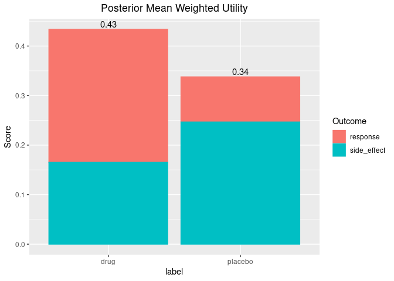

<!-- README.md is generated from README.Rmd. Please edit that file -->

# brisk

<!-- badges: start -->

[](https://github.com/rich-payne/brisk/actions/workflows/R-CMD-check.yaml)
[](https://github.com/rich-payne/brisk/actions/workflows/cover.yaml)
[](https://github.com/rich-payne/brisk/actions/workflows/lint.yaml)
[](https://r-pkg.org/pkg/brisk)

<!-- badges: end -->

The goal of `brisk` is to provide general helper functions to perform
quantitative *B*ayesian benefit-*risk* (brisk) analyses which are
completely separate from the Bayesian analyses. The functions in `brisk`
are intended to take samples from Bayesian posteriors as inputs,
allowing users to employ whatever custom analyses are appropriate. The
posteriors are then combined with utility functions and weights to
provide a quantitative benefit-risk analysis.

# Example

For each benefit or risk, a weight and utility function are specified.
The utility function takes parameter values as inputs and outputs
utility values. For a given set of parameter values for each benefit and
risk, the benefit-risk score can be calculated by taking a weighted
average of the utility functions. Incorporating uncertainty into the
estimate through a Bayesian posterior then yields a posterior
distribution on the benefit-risk score.

Benefits and risks are specified in `brisk` using the `benefit()` and
`risk()` functions. These functions require the name of the
benefit/risk, a utility function, and a weight. These utility functions
and weights are then combined with samples from the posterior
distributions of different groups through the `br_group()` function.

Suppose we have a new treatment that is being tested against a placebo
for a particular disease. For this population of patients, it is
determined that a response in less than 50% of patients is not very
beneficial, but, above 50% response rate, there is a consistently higher
benefit. Therefore a utility function is constructed to quantify this
belief (higher y-axis values are better):

``` r
benefit_fun <- approxfun(c(0, 0.5, 1), c(0, 0.2, 1))
curve(benefit_fun, xlab = "Response Rate", ylab = "Benefit Utility Function")
```


The drug is also believed to have some side effects. The side effects
are considered mild, but, having more than 30% of subjects having a side
effect becomes problematic, and more than 60% is particularly troubling.
We construct a utility function to represent this belief (higher y-axis
values are better)

``` r
risk_fun <- approxfun(c(0, 0.3, 0.6, 1), c(1, 0.9, 0.2, 0))
curve(risk_fun, xlab = "Side-Effect Rate", ylab = "Risk Utility Function")
```


Since the side effects are mild, we will assign greater weight on
ensuring that the drug works (75%) and a lower weight on the side
effects (25%). Therefore, if an arm in the clinical trial had a known
“true” response rate of 60% and a side-effect rate of 10%, the
benefit-risk value would be

``` r
.75 * benefit_fun(0.60) + 0.25 * risk_fun(0.10)
#> [1] 0.5116667
```

whereas an arm with a “true” 10% benefit and 80% side-effects would have
a lower score of

``` r
.75 * benefit_fun(0.10) + 0.25 * risk_fun(0.80)
#> [1] 0.055
```

In practice, we don’t actually know the “true” response rates or side
effect rates, so including uncertainty in the estimate based on the data
helps us to better quantify the amount of evidence for or against a new
treatment. A natural way to do this is through a Bayesian analysis.
Given samples from the Bayesian posterior (based on data), we can
estimate the uncertainty in the benefit-risk score of each treatment
arm.

Suppose we had 100 patients each in the placebo and treatment arms of
the study. Suppose that 30 responded on the placebo arm and 60 responded
on the treatment arm and 3 and 40 patients had side effects on the
placebo and treatment arms, respectively. Using conjugate beta-binomial
Bayesian models (calls to `rbeta()` below), we can obtain a posterior on
the benefit-risk score for each group.

``` r
library(brisk)
set.seed(1132)
out <- br(
  benefit("response", benefit_fun, weight = .75),
  risk("side_effect", risk_fun, weight = .25),
  br_group(
    label = "placebo",
    response = rbeta(1e4, 1 + 30, 1 + 70),
    side_effect = rbeta(1e4, 1 + 3, 1 + 97)
  ),
  br_group(
    label = "drug",
    response = rbeta(1e4, 1 + 60, 1 + 40),
    side_effect = rbeta(1e4, 1 + 40, 1 + 60)
  )
)

head(out)
#> # A tibble: 6 × 11
#>   response response_weight response_utility response_score side_effect
#>      <dbl>           <dbl>            <dbl>          <dbl>       <dbl>
#> 1    0.385            0.75           0.154          0.116       0.0276
#> 2    0.311            0.75           0.124          0.0933      0.0314
#> 3    0.352            0.75           0.141          0.106       0.0631
#> 4    0.334            0.75           0.133          0.100       0.0586
#> 5    0.388            0.75           0.155          0.117       0.0184
#> 6    0.230            0.75           0.0921         0.0691      0.0438
#> # … with 6 more variables: side_effect_weight <dbl>, side_effect_utility <dbl>,
#> #   side_effect_score <dbl>, label <chr>, iter <int>, total <dbl>
```

For each benefit/risk, there is a column with the posterior parameter,
the weight, the utility (given a parameter value), and the score (weight
times utility). There is also a column labeling the groups (“label”) and
a total benefit-risk score (“total”, which is the sum of the columns
with the suffix "\_score"). This output has all the information to make
useful inference, but, `brisk` provides some useful functions to make
this easier. For instance, we can very quickly get a summary of the
posterior benefit-risk scores using the `summary()` function:

``` r
summary(out)$summary
#> # A tibble: 2 × 4
#>   label    mean `2.50%` `97.50%`
#>   <chr>   <dbl>   <dbl>    <dbl>
#> 1 drug    0.434   0.310    0.558
#> 2 placebo 0.338   0.312    0.366
```

These can even be adjusted relative to a specific arm:

``` r
summary(out, reference = "placebo")$summary
#> # A tibble: 1 × 5
#>   label   mean `2.50%` `97.50%` reference
#>   <chr>  <dbl>   <dbl>    <dbl> <chr>    
#> 1 drug  0.0960 -0.0307    0.223 placebo
```

We can also calculate the posterior probability of certain scores. For
instance, we can calculate the probability that the difference in
benefit-risk scores between the treatment and placebo arms is greater
than zero (i.e. the treatment arm is better).

``` r
pbrisk(out, q = 0, reference = "placebo", direction = "upper")
#> # A tibble: 1 × 5
#>   label     q  prob direction reference
#>   <chr> <dbl> <dbl> <chr>     <chr>    
#> 1 drug      0 0.929 upper     placebo
```

Or, one can alternately specify probability cutoffs to obtain quantiles
in a long format.

``` r
qbrisk(out, p = c(0.1, .5, .9), reference = "placebo")
#> # A tibble: 3 × 4
#>   label     p quantile reference
#>   <chr> <dbl>    <dbl> <chr>    
#> 1 drug    0.1   0.0116 placebo  
#> 2 drug    0.5   0.0962 placebo  
#> 3 drug    0.9   0.181  placebo
```

There are also some useful plotting functions to plot the posterior
distribution of the benefit-risk scores for each group, or relative to a
group.

``` r
plot(out)
```


``` r
plot(out, reference = "placebo")
```


Lastly, there are some useful functions for plotting the posterior
weighted mean utility of each benefit/risk for each group.

``` r
plot_utility(out)
```


``` r
plot_utility(out, reference = "placebo")
```


``` r
plot_utility(out, stacked = TRUE)
```



# Additional Notes

In addition to the `br()` function, `brisk` also has an `mcda()`
function which performs in exactly the same way as `br()`, except that
it imposes additional constraints which are typical in the MCDA analyses
(e.g. that weights sum to 1 and that observed outputs of the utility
functions are constrained between 0 and 1).

Also note that the `br()` and `mcda()` functions can process an
arbitrary number of benefits, risks, and groups, allowing it to handle a
variety of benefit-risk analyses.
